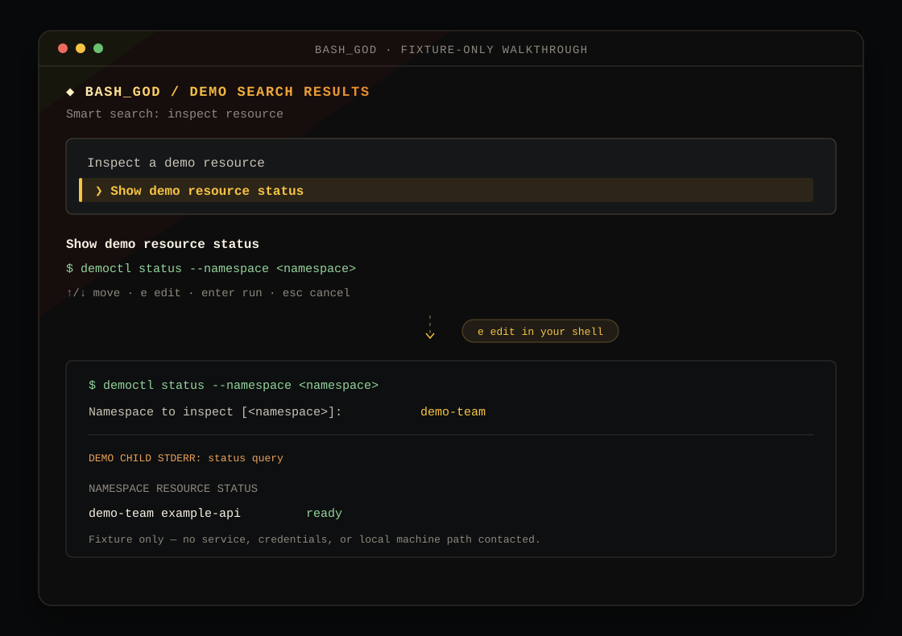

# BASH_GOD

```text
██████╗  █████╗ ███████╗██╗  ██╗    ██████╗  ██████╗ ██████╗
██╔══██╗██╔══██╗██╔════╝██║  ██║   ██╔════╝ ██╔═══██╗██╔══██╗
██████╔╝███████║███████╗███████║   ██║  ███╗██║   ██║██║  ██║
██╔══██╗██╔══██║╚════██║██╔══██║   ██║   ██║██║   ██║██║  ██║
██████╔╝██║  ██║███████║██║  ██║   ╚██████╔╝╚██████╔╝██████╔╝
╚═════╝ ╚═╝  ╚═╝╚══════╝╚═╝  ╚═╝    ╚═════╝  ╚═════╝ ╚═════╝
```

**A local command memory for operators.** Search for the command you half remember, read the native
syntax, then inspect, edit, or run it in the terminal you are already using.

[](https://github.com/hemang11/BASH-GOD/releases/latest)
[](LICENSE)

BASH_GOD is a curated, local index of real DevOps commands. It does not invent a new CLI language or
hide the underlying tools: Kafka, `kubectl`, `aws`, `mongosh`, `curl`, and ordinary shell commands
remain the source of truth.

## Search, inspect, then decide

```text
$ god kafka -q "consumer lag"

╭────────────────────────────────────────────────────────────────────────╮
│ KAFKA SEARCH RESULTS                                                   │
│ Smart search: consumer lag                                             │
╰────────────────────────────────────────────────────────────────────────╯

  ❯ Show consumer-group offsets and lag
    Show latest offsets for a topic [needs v3.0+ (have v1.1.0)]

  Show consumer-group offsets and lag
  $ /path/to/kafka/bin/kafka-consumer-groups.sh --bootstrap-server localhost:9092 --group <consumer_group> --describe
  ↑/↓ move · e edit · enter run · esc cancel
```

On a usable TTY, a resolved service opens the in-place picker shown above:

- Arrow keys move the selection without leaving your terminal buffer.
- `e` opens your normal shell line editor with the complete command already inserted.
- Enter runs the selected reviewed command. Remaining placeholders are requested only then.
- Escape returns to your prompt. Native stdout, stderr, exit status, and Ctrl-C remain native.

If BASH_GOD cannot resolve a service client, terminal, or command requirement, it stays in its static
copy-ready view. Nothing is executed merely by searching or browsing.



## Install

The direct GitHub Release installer is the supported public installation path today:

```bash
bash <(curl -fsSL https://github.com/hemang11/BASH-GOD/releases/latest/download/install.sh)
```

Or install the same reviewed runtime through the official Homebrew tap:

```bash
brew install hemang11/tap/bash-god
```

It installs `god` under `~/.local/bin` and its runtime under `~/.local/lib/bash-god`. It does not
require `sudo` and does not modify `.bashrc`, `.zshrc`, or another shell startup file. If needed, it
prints the exact `PATH` export to add.

```bash
god
god kafka -q "consumer lag"
```

The direct installer ships macOS (Intel and Apple Silicon) and Linux (x86_64 and ARM64) helpers.
BASH_GOD itself requires Bash 3.2 or later. A service's own client remains its prerequisite: install
Kafka to use Kafka commands, `kubectl` for Kubernetes, and so on.

For a source checkout, run `./god` from the repository. You may also source `BASH_GOD.sh` for the
current shell only; sourcing is silent and does not alter shell startup files.

```bash
git clone https://github.com/hemang11/BASH-GOD.git
cd BASH-GOD
./god kafka
```

Direct-release installations can update from a bare interactive `god` invocation and can be removed
with `god --uninstall`. Homebrew owns its own installations: use `brew upgrade bash-god` and
`brew uninstall bash-god`. Source checkouts remain under Git's control.

## Everyday routes

| Need | Command |
|---|---|
| Browse a service | `god kafka` |
| Read a focused group | `god k8s logs` |
| Explain one numbered row | `god kafka offset 1` |
| Search by remembered intent | `god kafka q "get all consumers"` |
| Search every service | `god q "find listening port"` |
| See a branch and its commands | `god kafka topics --tree --full` |
| See resolved clients and Targets | `god --paths` |
| Refresh all detectable services | `god --resync` |

Search is case-insensitive and considers command titles, descriptions, parameters, options, notes,
and native syntax. Use `--any`, `--all`, `--exact`, or `--regex` when you need a narrower match.

## What is included

| Service | Start here | Execution model |
|---|---|---|
| AWS | `god aws` | Resolved AWS CLI and client context |
| Elasticsearch | `god elasticsearch` | Resolved `curl` and optional HTTP Target |
| General system | `god general` | Native commands found on `PATH` |
| Kafka | `god kafka` | Resolved Kafka installation and optional broker Target |
| Kubernetes | `god k8s` | Resolved `kubectl` and kubeconfig context |
| MongoDB | `god mongo` | Resolved Mongo shell and optional server Target |
| Network | `god network` | Native commands found on `PATH` |

The catalog favors common operational work over a mirror of every manual page. Each service also has
a `native` group for the installed tool's own help.

## What “reviewed execution” means

The same plain-text catalog record powers search, help, detail pages, tree views, and the picker.
Catalog files are parsed as data, never sourced as shell code.

For an executable service, BASH_GOD checks only declared local facts: its client path, relevant
version range, operating-system/tool requirements, and (where applicable) a cached service Target.
Per-command compatibility stays beside the command title. A known incompatible or unavailable row
remains visible for reference but cannot be edited or run through the picker.

`god <service> --resync` refreshes the client and any declared connection fact. `god --paths` shows
what was found, the catalog's review baseline, and `Target: host:port` or `Target: unresolved` for
endpoint services. A local listener is only a candidate; it is not proof that a remote service is
reachable.

### Use a client installed outside the default locations

Discovery checks the catalog's reviewed installation roots and your `PATH`; it intentionally does
not crawl personal directories. If you extracted Kafka somewhere custom, point BASH_GOD at its
**bin directory** once, then resync:

```bash
mkdir -p ~/.config/bash-god
printf 'path=%s\n' "$HOME/Documents/kafka_2.11-1.1.0/bin" > ~/.config/bash-god/kafka.conf
god kafka --resync
```

Use the same one-line `path=` file for another discoverable service by replacing `kafka` with the
service name and supplying the directory containing its client executable. This is an explicit local
path override; it takes precedence over the catalog defaults and `PATH`.

BASH_GOD does not translate arbitrary Linux commands into macOS commands, guess credentials, or
contact infrastructure while rendering a view. If a command does not meet its declared environment
requirements, it is knowledge—not a locally runnable offer.

## Add a command

Service knowledge lives in one catalog per service:

```text
catalog/<service>/service.god
```

Add the human-readable native command a person would actually type, its compatibility floor,
requirements, parameters, and risk label where needed. The shared engine supplies search, rendering,
compatibility, placeholder resolution, and execution; do not add a service-specific renderer or
dispatcher.

Read the [contribution guide](CONTRIBUTING.md) before editing a catalog. The complete grammar and
fake-only verification workflow live in the [catalog contract](catalog/AGENTS.md).

## Contribute and get help

- [Contribute catalog knowledge](CONTRIBUTING.md)
- [Report a reproducible bug](https://github.com/hemang11/BASH-GOD/issues/new?template=bug_report.yml)
- [Support boundaries](SUPPORT.md)
- [Architecture guide](docs/architecture/README.md)
- [Build and verify release archives](packaging/README.md)

Please redact credentials, tokens, private hostnames, payloads, and customer data from an issue. A
good report includes the BASH_GOD version, operating system and architecture, shell, terminal or SSH
context, installation method, and minimal reproduction steps.

## Limits

- The catalog is deliberately useful rather than exhaustive.
- Search is ranked word matching, not an embedding or conversational model.
- Native flags and behavior still depend on the installed tool and environment.
- Direct-release update and uninstall behavior applies only to direct GitHub Release installations.
  Homebrew installations remain owned by Homebrew.

## License

BASH_GOD is available under the [MIT License](LICENSE). Use it, modify it, and share it—including
commercially—while retaining the copyright and license notice. It is provided without warranty.
